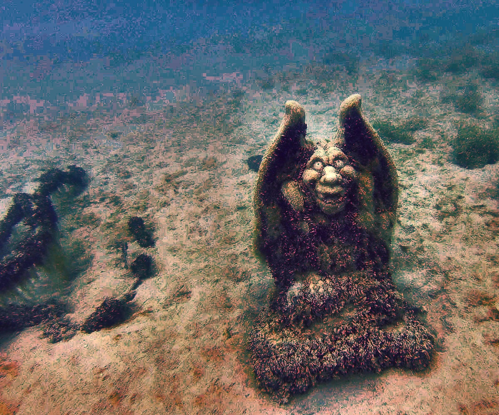

# Underwater Image Enhancement Tool

[](https://opencv.org/)
[](https://www.python.org/)
[](https://pypi.org/project/PyQt5/)
[](https://isocpp.org/)
[](LICENSE)

**A real-time, interactive tool for enhancing underwater imagery using physics-based color restoration and dehazing techniques.**

This project provides a complete pipeline to correct color casts, remove haze, and improve contrast in underwater photos. It includes both a user-friendly **Python (PyQt5) GUI** version and a high-performance **C++ (OpenCV)** version.

---

## 📸 Results

| **Original Input** | **Enhanced Output** |
| :---: | :---: |
|  |  |

---
## 🎥 Video Demo

Here is a real-time comparison.

<table>
  <tr>
    <th width="50%">Original Video Input</th>
    <th width="50%">Enhanced Video Output</th>
  </tr>
  <tr>
    <td>
      <video src="figs/video1.mp4" controls="controls" muted="muted" style="max-width: 100%;"></video>
    </td>
    <td>
      <video src="figs/enhanced_video.mp4" controls="controls" muted="muted" style="max-width: 100%;"></video>
    </td>
  </tr>
</table>

> **Note**: If the video does not play, please try using a different browser or check the file path.

## 🖼️ Dataset

This project uses the **UIEB (Underwater Image Enhancement Benchmark)** dataset for testing and validation. The raw dataset preserves the original underwater lighting conditions, making it ideal for evaluating restoration algorithms.

* **Dataset Name**: UIEB Dataset (Raw)
* **Download Link**: [Kaggle - UIEB Dataset Raw](https://www.kaggle.com/datasets/larjeck/uieb-dataset-raw)
* **Description**: Contains raw underwater images covering various water types (greenish, bluish, turbid).

**How to use:**
1.  Download the dataset from the Kaggle link above.
2.  Extract the images into a local folder.
3.  Use the "Load Image" button in the Python tool to test these images.

---

## ✨ Features 

The enhancement pipeline consists of 6 modular stages designed to tackle specific underwater degradation issues:

1.  **White Balance Correction (LAB)**: Corrects color casts by adjusting A (Green-Red) and B (Blue-Yellow) channels in LAB space.
2.  **Red Channel Restoration**: Compensates for the severe absorption of red light using histogram equalization.
3.  **CLAHE**: Contrast-Limited Adaptive Histogram Equalization for improving local contrast without amplifying noise.
4.  **Dark Channel Dehazing**: Removes underwater haze/fog using the Dark Channel Prior (DCP) algorithm.
5.  **Adaptive Sharpening**: Unsharp masking to enhance edge details.
6.  **Gamma Correction**: Brightens shadow regions to reveal hidden details.

---

## 🛠️ Quick Start

### Option 1: Python Version (GUI)
*Best for interactive testing and parameter tuning.*

**Requirements:**
```bash
pip install opencv-python numpy PyQt5

```

**Run:**

```bash
python underwater_enhance.py

```

**User Guide:**

1. Click **"Load Image"** to select a file.
2. Adjust sliders (Omega, CLAHE, Shifts) to see real-time changes.
3. Click **"Save Result"** to export the enhanced image.

### Option 2: C++ Version (High Performance)

*Best for batch processing or embedded integration.*

**Requirements:**

* C++ Compiler (GCC, Clang, MSVC)
* OpenCV 4.x (Development headers)

**Compile (Linux/Mac with g++):**

```bash
g++ underwater_enhance.cpp -o EnhanceApp `pkg-config --cflags --libs opencv4`

```

**Compile (Windows with CMake):**
A standard `CMakeLists.txt` is recommended for linking OpenCV on Windows.

**Run:**

```bash
./EnhanceApp path/to/image.jpg

```

*(Press 'S' to save result, 'Q' to quit)*

---

## 📂 Project Structure

```text
Underwater-Image-Enhancement/
├── figs/                    # Result images for README
│   ├── 8_img_.png
│   └── enhanced_result.jpg
├── underwater_enhance.py    # Python source code with PyQt5 GUI
├── underwater_enhance.cpp   # C++ source code with OpenCV HighGUI
├── README.md                # Project documentation
└── requirements.txt         # Python dependencies

```

## 📊 Pipeline Comparison

| Stage | Visual Effect | Description |
| --- | --- | --- |
| **Original** | Hazy, Blue/Green Cast | Low visibility and color distortion. |
| **WB + Red** | Color Corrected | Red component restored, color cast removed. |
| **Dehaze** | Clearer | Haze/Fog removed, transmission map applied. |
| **Final** | Sharp & Natural | Local contrast enhanced and edges sharpened. |


## 🔗 Citation

If you use this code or the original method, please acknowledge the source:

```bibtex
@misc{opencv_underwater_2025,
  title = {Guide to Underwater Image Enhancement Using OpenCV},
  author = {Samruddhi},
  year = {2025},
  howpublished = {\url{[https://opencv.org/blog/underwater-image-enhancement-using-opencv/](https://opencv.org/blog/underwater-image-enhancement-using-opencv/)}},
  note = {Accessed: 2025-12-17},
  organization = {OpenCV.org}
}
```

## 📄 License

This project is open source and available under the [MIT License](https://www.google.com/search?q=LICENSE).
